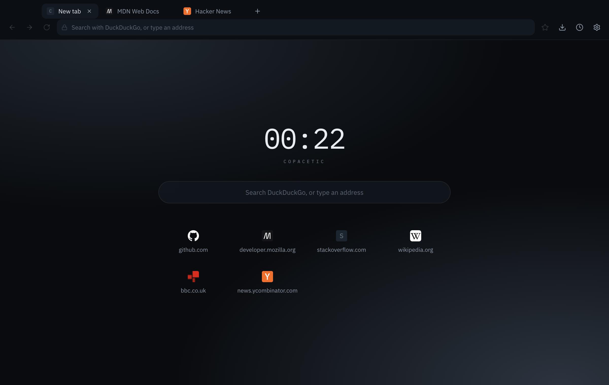

# Copacetic

A desktop browser that tells you the truth about the page you are on.

Copacetic renders pages with Chromium, through Electron. It is a browser
_interface_, not a browser _engine_ — the rendering, networking and sandboxing
belong to Chromium. What Copacetic adds is the part you actually touch: the tab
strip, the address bar, the permission prompts, and a set of decisions about
what a browser should and should not do on your behalf.



---

## Why it exists

Most browser UI hides the state of the page behind a padlock that means very
little. Copacetic has one rule that shapes the whole interface:

> **The chrome is monochrome. Colour only ever appears where it carries state.**

If something is green it is because the connection is genuinely encrypted. If
the address bar says "Not secure", the page really is being served over plain
HTTP. There is no decorative accent colour anywhere in the interface, so the one
place colour appears is the one place worth looking.

## What it does

**Addresses you can actually read.** The address bar is not a text field until
you click it. It renders the URL structurally, with the registrable domain at
full contrast and everything else dimmed, in a monospace face. So
`paypal.com.attacker.net/login` reads as **attacker.net** — which is the point.
Which part counts as the domain comes from the full IANA Public Suffix List, so
`user.github.io` and `example.pvt.k12.ma.us` are read correctly rather than
approximated, and two projects sharing a host never look like the same site.

**Honest connection reporting.** Click the badge in the address bar for the real
scheme, the host, the measured load time, how many tracker requests were blocked
on this page, and — on an encrypted connection — who issued the certificate and
when it expires. An expiry inside a fortnight is the one thing there that turns
amber, because it is state you cannot see any other way. When Copacetic cannot
describe a connection, it says so rather than guessing.

**It tells you when something is reading your connection.** If a site's
certificate chains to a root installed on this machine rather than one your
system shipped with — a company proxy, antivirus, or a debugging tool
intercepting TLS — the panel says so. Every mainstream browser shows the same
padlock in that situation as in any other.

**Every host a page contacted, not just the blocked ones.** The connection panel
lists each host the page actually talked to, how many requests went to it, and
which were stopped. The blocked count tells you what was prevented; this tells
you what was allowed, which is the half no mainstream browser shows without
opening developer tools.

**Tracker blocking that does not break pages.** A curated list of ~120 domains
that exist only to follow people between sites. Not an EasyList engine — a
short, honest list, and the count you see is the real number of blocked
requests, not an estimate. Top-level navigation is never blocked, so you can
still visit a tracker domain deliberately.

**Local-only suggestions.** As you type, the list under the address bar is
ranked from your own history and bookmarks, in the main process. No keystroke is
sent anywhere to fetch remote suggestions.

**Downloads with real controls.** Pause, resume, cancel, open, reveal in the
file manager. Live throughput and time remaining. Filenames are sanitised
against directory traversal and against right-to-left override tricks that
disguise an `.exe` as a `.jpg`.

**Sites that ask you to sign in.** HTTP authentication — the challenge
intranets, routers, NAS boxes and plenty of dev servers use — is answered
through a prompt in the chrome. Copacetic only asks when the challenge comes
from the site the address bar is showing, or from the proxy for your network;
a subresource on some other origin asking for a password gives you nothing to
judge. Nothing is stored, because there is no password manager yet and keeping
a password somewhere undescribed is not a thing this browser will do.

**The rest of what a browser needs.** Tab drag-reorder, middle-click close,
audio indicators and per-tab mute, find-in-page with match counts, per-tab zoom,
session restore, a command palette (`Cmd/Ctrl+K`), native context menus, and a
full application menu so copy/paste and every shortcut behave the way the
platform expects.

## Security

The threat model is the obvious one: Copacetic renders hostile content by
design. The measures below are the ones that follow from that.

| Concern                              | What Copacetic does                                                                                                                                                                                                                                                       |
| ------------------------------------ | ------------------------------------------------------------------------------------------------------------------------------------------------------------------------------------------------------------------------------------------------------------------------- |
| Page code reaching the app           | Tabs run with `sandbox: true`, `contextIsolation: true`, no `nodeIntegration`, and **no preload script at all**                                                                                                                                                           |
| Renderer compromise reaching the OS  | The chrome renderer is sandboxed too; every IPC handler rejects messages that did not come from the chrome window's own top-level frame                                                                                                                                   |
| Page data reaching the chrome        | Web content lives in its own persistent session partition, separate from the session running the interface                                                                                                                                                                |
| Chrome renderer being navigated away | `will-navigate` is refused for anything that is not the app's own document, so the preload bridge can never be handed to a remote origin                                                                                                                                  |
| Popups imitating browser chrome      | `setWindowOpenHandler` denies every window. Pages get a tab, never a window                                                                                                                                                                                               |
| Dangerous URL schemes                | `javascript:`, `data:`, `blob:`, `vbscript:` and `filesystem:` are refused for top-level navigation, from the address bar and from page code alike — and are never handed to another application instead. `file:` is yours to type, but page code cannot send a tab there |
| `<webview>` injection                | Disabled in `webPreferences` _and_ refused in `will-attach-webview`, so the guarantee does not rest on one options object staying correct                                                                                                                                 |
| Over-broad permissions               | Device access (serial, HID, USB), ambient signals (idle detection, local fonts, window placement) and cross-site storage are denied outright, without a prompt. Only permissions a user can meaningfully evaluate are ever asked about                                    |
| Favicon requests leaking             | Favicons are fetched by the main process in the web session and handed to the interface as data URLs, so the chrome renderer never makes a network request. A remote page cannot name a loopback or private-network host and have that request made on its behalf         |
| Chrome document XSS                  | A strict CSP with `default-src 'none'`, `connect-src 'self'`, `object-src 'none'` and `frame-ancestors 'none'`                                                                                                                                                            |
| Malicious download filenames         | Path components, control characters and bidirectional overrides are stripped before a file is written                                                                                                                                                                     |

Copacetic presents a plain Chrome user agent rather than advertising Electron:
better site compatibility, and one less signal that fingerprints you as unusual.

### What it does not do

Being straight about the gaps, since the whole project is about not overstating
things:

- **No sync, no accounts, no cloud.** Everything lives in `userData` on this
  machine. The one request Copacetic makes on its own behalf is the update
  check, which reads a version number from the GitHub releases API and sends
  nothing about you. It can be turned off in Settings.
- **No extension support.** Chrome extensions are not loaded.
- **No DRM.** Widevine is not bundled, so Netflix and Spotify will not play.
- **Certificate inspection is Chromium's.** The badge reports the issuer and
  expiry of the certificate Chromium accepted; it does no chain analysis of its
  own, and a certificate Chromium rejected is never described at all — a failed
  connection must not be dressed up as an informative one.
- **Not audited.** A personal project built to a high standard, not a browser
  that has been through security review.

## Architecture

Page content is owned by the **main process** as one `WebContentsView` per tab.
The renderer is pure interface — it never touches page content, and it holds no
browser state of its own.

```
electron/
  main/
    index.ts          app lifecycle, single-instance lock
    browser.ts        orchestrator; every command menus and IPC call into
    tabs.ts           WebContentsView per tab, navigation, find, favicons
    security.ts       session hardening, navigation guards, permission policy
    blocker.ts        tracker blocking and per-tab counting
    downloads.ts      pause/resume/cancel, filename sanitising
    store.ts          history, bookmarks, settings, session (atomic JSON)
    menu.ts           application menu — also the keyboard shortcut table
    context-menu.ts   native page and tab menus
    protocol.ts       serves the exported interface over copacetic-app://
    ipc.ts            typed, sender-validated handlers
  preload/index.ts    the only bridge; forwards no caller-supplied channel
  shared/             types, channel names and URL logic used by both sides
src/                  Next.js interface (static export, no server)
```

Two consequences of `WebContentsView` shape the interface, and both turned out
to be improvements:

- **A native view always paints above the renderer's HTML.** So the address-bar
  suggestion list and the find bar are not floating popovers — they are real
  chrome, and the page is pushed down to make room. Full-area panels (settings,
  history, downloads) hide the tab view instead of covering it.
- **The renderer measures its own layout** and reports the content rectangle to
  the main process, which parks the tab view exactly over the hole. Resizing is
  handled in the main process from cached insets, so it never lags a round trip
  behind.

## Download

Installers for macOS, Windows and Linux are on the
[latest release](https://github.com/ryjord/Copacetic/releases/latest):
`.dmg` (macOS, arm64 and x64), `Setup.exe` (Windows) and `.AppImage` / `.deb`
(Linux). Builds are not code-signed, so expect an "unidentified developer" or
SmartScreen prompt on first launch.

On macOS, Gatekeeper will refuse the app outright rather than just warning.
Right-click the app and choose Open, or clear the quarantine flag:

```bash
xattr -cr /Applications/Copacetic.app
```

### Staying up to date

Copacetic checks whether a newer release exists and shows what it finds in
Settings. What it can do about it depends on the build, and it says so rather
than pretending:

| Build                 | What happens                                            |
| --------------------- | ------------------------------------------------------- |
| Windows (`Setup.exe`) | Downloads in the background, installs when you quit     |
| Linux (`.AppImage`)   | Downloads in the background, installs when you quit     |
| macOS (`.dmg`)        | Tells you a version is available and links the download |
| Linux (`.deb`)        | Tells you, and links the download — manual for now      |

macOS is manual because installing an update in place requires a code-signed
app, and Copacetic is not signed. That is a cost decision, not an oversight,
and it is stated in Settings rather than hidden behind a button that fails.

The `.deb` never updates itself, because the file belongs to `dpkg`. The
intended answer is an apt repository, which is built and signed already — but
it needs somewhere to live that will accept a 150 MB package, and that is not
yet set up. Until it is, the `.deb` installs without touching your apt
configuration at all and new versions are a manual download. See
[docs/apt-repository.md](docs/apt-repository.md).

If you want updates handled for you on Linux today, use the `.AppImage`, which
updates itself in place.

## Running it

Requires Node 20.9 or newer.

```bash
npm install
npm run dev      # Next dev server + main process watch + Electron
```

Build and run the production path:

```bash
npm run build
npm start
```

Package a distributable into `release/`:

```bash
npm run package
```

### Checks

```bash
npm run verify   # format check, lint, typecheck (3 projects), unit tests
```

Unit tests cover the parts where being wrong is expensive: address resolution
(including every dangerous-scheme case), registrable-domain extraction for the
address bar, tracker matching, and download filename sanitising.

## Keyboard

|                                   |                                   |
| --------------------------------- | --------------------------------- |
| `Cmd/Ctrl+T` / `Cmd/Ctrl+W`       | New tab / close tab               |
| `Cmd/Ctrl+Shift+T`                | Reopen the last closed tab        |
| `Cmd/Ctrl+L`                      | Focus the address bar             |
| `Cmd/Ctrl+K`                      | Command palette                   |
| `Cmd/Ctrl+F` / `Cmd/Ctrl+G`       | Find on page / find next          |
| `Cmd/Ctrl+R` / `Cmd/Ctrl+Shift+R` | Reload / reload ignoring cache    |
| `Cmd/Ctrl+[` / `Cmd/Ctrl+]`       | Back / forward                    |
| `Cmd/Ctrl+D`                      | Bookmark this page                |
| `Cmd/Ctrl+1`…`8` / `Cmd/Ctrl+9`   | Select tab by position / last tab |
| `Cmd/Ctrl+Y` / `Cmd/Ctrl+Shift+J` | History / downloads               |
| `Cmd/Ctrl+ +` / `-` / `0`         | Zoom in, out, reset               |

## Where your data lives

Plain JSON in Electron's `userData` directory, written atomically:
`settings.json`, `history.json`, `bookmarks.json`, `downloads.json`,
`favicons.json`, `session.json`, `window.json`. History older than 90 days is
dropped on launch. A corrupt file is moved aside rather than blocking startup.

- macOS: `~/Library/Application Support/Copacetic`
- Linux: `~/.config/Copacetic`
- Windows: `%APPDATA%\Copacetic`

## Licence

MIT. See [LICENSE](LICENSE).
